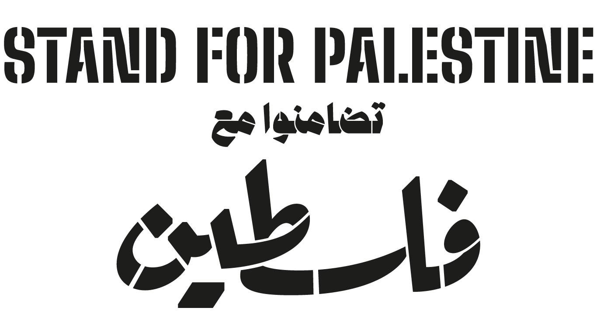

# Stand for Palestine

The momentum which started with social media documentation of crimes committed against Palestinians in Jerusalem, Gaza, The West Bank and the occupied land of Palestine has catalyzed a historical moment which is ripe for transformation.  

For the first time in 73 years of occupation the world is uniting to call  Israelis apartheid, settler colonialism, and ethnic cleansing of the Palestinians people for what it is. 

The liberation of Palestine can only happen when individuals arm themselves with proper education and truth to debunk manipulative tactics which try to conflate anti-zionism and anti settler colonialism with anti jewish rhetoric. 

We created this platform to equip you with trusted historical and educational resources while also providing updates of the ongoing escalations in Palestine from the perspective of activists in the mids of the situation. 
  
Staying neutral in situations of oppression puts you on the side of oppressor. The UN has been calling Israel out for countless violations of international humanitarian law and war crimes since the beginning of its conception. The most powerful countries and companies in the world work relentlessly to sheild Israel from all consequences while financial supporting its war crimes. 

This moment is proof that solidarity and the truth can not be silenced. It is the responsibility of anyone who is alive to witness this injustice to speak out in the noble plight of liberating the Palestinian people. 
